 

 

<a href="#-about-me">About</a> •
<a href="#️-tech-stack">Tech Stack</a> •
<a href="#-dsa--leetcode">DSA</a> •
<a href="#-featured-projects">Projects</a> •
<a href="#-github-stats">Stats</a> •
<a href="#-connect-with-me">Connect</a>

---

## 🧬 About Me

| | |
|---|---|
| 👤 **Name** | Chetan Dixit |
| 🎓 **Degree** | B.Tech, Computer Science & Engineering |
| 💼 **Role** | Java Developer · Aspiring ML Engineer |
| 🛠️ **Tech Stack** | Java, Python, TensorFlow, Keras, Scikit-learn |
| 🧠 **Interests** | Machine Learning · Deep Learning · DSA · Full-Stack Dev |
| ⚡ **Currently** | Building deep learning projects & sharpening DSA in Java |
| 🎯 **Goal** | Become a skilled Software Engineer & ML Developer |
| 💬 **Ask Me About** | Java, OOP, DSA, TensorFlow/Keras, Neural Networks |

---

## 🛠️ Tech Stack

**Languages**

**Machine Learning & Data Science**

**Web Development**

**Tools & Platforms**

---

## 🔥 Current Focus

- 🧩 Data Structures & Algorithms
- ☕ Advanced Java & OOP
- 🤖 Machine Learning Specialization
- 🧠 Deep Learning Fundamentals
- 🛠️ Building Real-World Projects
- 🌍 Open Source & GitHub Portfolio Development

---

## 🧩 DSA & LeetCode

| 📊 Stat | Value |
|---|---|
| ✅ Problems Solved | 101 (Java: 100 · Python: 1) |
| 🏅 Badges | 1 — *50 Days Badge 2026* |
| 🧠 Strongest Areas | Array, Two Pointers, String, Math, Hash Table |
| 📈 Advanced Topics | Dynamic Programming, Divide & Conquer, Backtracking |

---

## 🚀 Featured Projects

### 🎬 Movie Recommender System (Two-Tower Neural Network)
A deep learning-based movie recommendation system built with TensorFlow/Keras using a Two-Tower architecture to learn user and movie embeddings for personalized recommendations.

### 🔢 Handwritten Digit Recognizer
Artificial Neural Network (ANN) built with TensorFlow and Keras to classify handwritten digits using the MNIST dataset.

### 📚 Student Management System (CLI)
A command-line based student management system built in Python, supporting full CRUD operations along with data persistence using JSON. Designed to demonstrate clean code organization, file handling, and object-oriented programming concepts.

### 🔮 More Projects Coming Soon...
- Machine Learning Projects
- Deep Learning Projects
- Full-Stack Web Applications
- Open Source Contributions

---

## 📊 GitHub Stats

---

## 🏆 Trophies

---

## ✍️ Dev Quote of the Day

---

## 📈 GitHub Goals for 2026

- ✅ Build 10+ high-quality projects
- ✅ Complete Machine Learning & Deep Learning Specializations
- ✅ Strengthen DSA and Competitive Programming skills
- ✅ Contribute to Open Source projects
- ✅ Create a strong Software Engineering & ML portfolio

---

## 📫 Connect With Me

---

⭐ Thanks for visiting my profile! Feel free to explore my repositories and connect with me.

